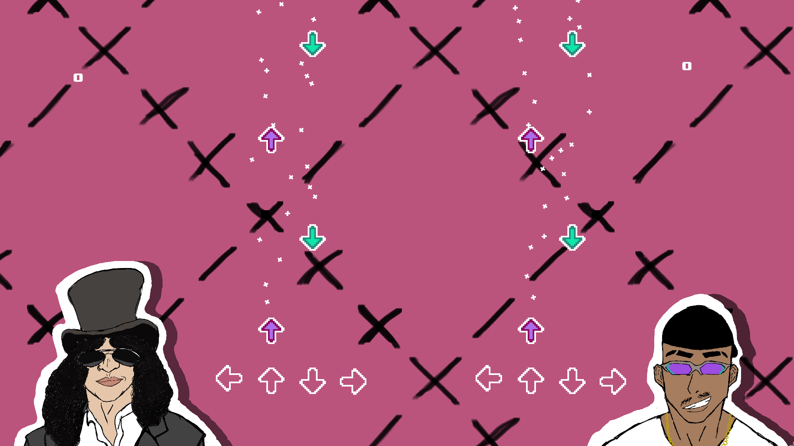

# 🎵 Jogo Rítmico — Tech Week Anhanguera

> Jogo rítmico para dois jogadores desenvolvido para a competição **Tech Week da Anhanguera**, criado com a engine **Godot**.

---

## 📸 Screenshot

<!-- Adicione a imagem do jogo aqui -->

---

## 🎮 Sobre o Projeto

**Jogo Rítmico** é um jogo de ritmo competitivo para dois jogadores, onde cada um deve pressionar os botões no momento certo, sincronizado com a música. Vence quem tiver maior precisão ao longo da fase!

O projeto foi desenvolvido como parte da **Tech Week da Anhanguera**, uma competição interna de desenvolvimento de jogos e tecnologia.

---

## ✨ Funcionalidades

- 🎯 Gameplay rítmico sincronizado com a música
- 👥 Modo 2 jogadores (local)
- 🏆 Sistema de pontuação por precisão
- 🎵 Notas caindo em tempo com o beat
- 📊 Placar em tempo real para ambos os jogadores
- ⚡ A cada loop da música a velocidade das notas aumenta, elevando a dificuldade progressivamente

---

## 🛠️ Tecnologias

| Ferramenta | Uso |
|------------|-----|
| [Godot Engine](https://godotengine.org/) | Engine principal do jogo |
| GDScript | Linguagem de programação |
| [MIDI Player (Plugin)](https://godotengine.org/asset-library/asset/1667) | Reprodução e sincronização MIDI |

---

## 🎮 Controles

| Jogador | Teclas |
|---------|--------|
| **Jogador 1** | `W` `A` `S` `D` |
| **Jogador 2** | `↑` `←` `↓` `→` |

---

## 📋 5W3H

| | Pergunta | Resposta |
|---|----------|----------|
| **What** | O que é? | Um jogo rítmico desenvolvido no Godot, onde dois jogadores competem pressionando teclas no ritmo da música |
| **Why** | Por quê? | Para destacar o aspecto musical da competição Tech Week da Anhanguera |
| **Who** | Quem? | Leonardo Bayma e Yuri Yoshizaki Goes |
| **Where** | Onde? | Repositório público disponível no GitHub |
| **When** | Quando? | Desenvolvido ao longo do período letivo, com entrega na Tech Week |
| **How** | Como? | Utilizando a engine Godot com GDScript, plugin MIDI Player e loop fechado de gameplay |
| **How much** | Quanto custou? | Custo financeiro zero — todas as ferramentas utilizadas são gratuitas e de código aberto |
| **How to measure** | Como medir? | Loop fechado de gameplay: o jogador vê as notas, pressiona as teclas no tempo certo e recebe feedback imediato de acerto ou erro com pontuação em tempo real |

---

## 📅 Diário de Produção

### 13/03/2026 — Base do jogo
Primeiro dia de desenvolvimento do jogo. Foi seguido um tutorial para estruturar a base, resultando nos componentes principais: **Game Manager**, **Score Manager**, **Inputs Manager** e **Midi Player**. Ainda restavam questões técnicas a resolver, como conectar dois pedaços de música para variar a dificuldade de forma incremental, e testar a sincronização do som com o input do jogador.

### 14/03/2026 — Investigando a lógica de sincronização
Foram investigados os detalhes do código de sincronização: a música MIDI começa a tocar e o sistema calcula o tempo até cada nota chegar na zona de clique, usando esse intervalo para iniciar o áudio. Foi identificado que sons tocados instantaneamente não ficavam perfeitamente em sincronia, o que virou um ponto de atenção para as próximas etapas.

### 02/04/2026 — Refatoração do sistema de input
O sistema de input foi refeito para que cada instância de jogador tivesse suas próprias teclas configuradas. Nessa etapa também foi melhor compreendido o funcionamento das filas de notas (`queue`), abrindo caminho para separar a pontuação de cada jogador e automatizar a configuração das cenas.

### 03/04/2026 — Cena base montada
Foi montada a cena base do jogo em conjunto. Com a estrutura principal pronta, o próximo passo identificado foi implementar o sistema de pontuação para então partir para a fase de polimento.

### 16/04/2026 — Limpeza do projeto
Remoção de todos os assets e cenas não utilizados, deixando o projeto mais organizado e limpo para a fase final.

### 07/05/2026 — Finalização das artes
Os assets visuais do jogo foram finalizados, concluindo a identidade visual do projeto.

### 09/05/2026 — Velocidade dinâmica
Implementação do sistema de aceleração da música a cada loop, adicionando progressão de dificuldade à gameplay.

---

## 🔮 Próximos Passos

- 🎵 Adição de novas músicas
- 🕹️ Novos modos de gameplay — a ideia é tornar cada partida única: a cada loop a música, a velocidade e o modo de jogo variam, criando uma experiência dinâmica e imprevisível
- 🔧 Refatoração do código — tornar os módulos mais independentes entre si e permitir que o número de jogadores seja escolhido dinamicamente
- 🚀 Publicação no [itch.io](https://itch.io) — para isso, alguns requisitos precisam ser atendidos antes do lançamento:
  - Escolha de um nome definitivo para o jogo
  - Personagens com animações, substituindo os sprites estáticos atuais
  - Temática e história simples, mas elaborada

---

## 📚 Referências

- [Building a Rhythm Game in Godot — Sergej Moor](https://medium.com/@sergejmoor01/building-a-rhythm-game-in-godot-part-1-synchronizing-gameplay-with-music-258b0bcab458) — referência principal de desenvolvimento e alguns assets utilizados

---

## 👨‍💻 Autores

Desenvolvido por **Leonardo Bayma** e **Yuri Yoshizaki Goes** para a **Tech Week — Anhanguera**

---

## 📄 Licença

Este projeto foi desenvolvido para fins educacionais e de competição. Assets externos pertencem aos seus respectivos autores.
